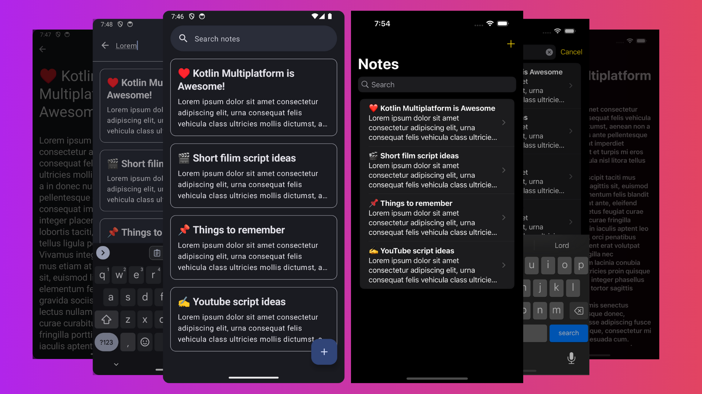
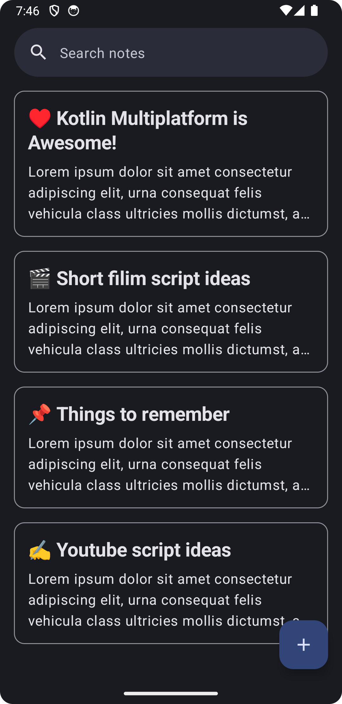
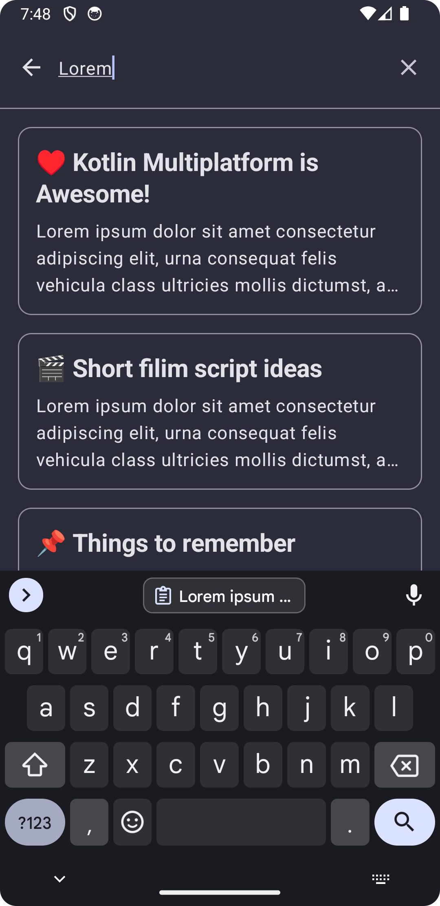
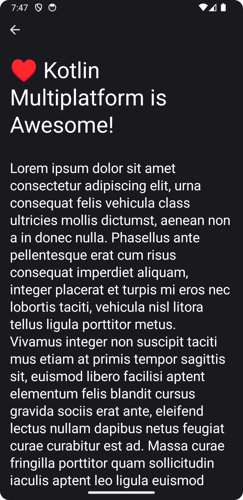
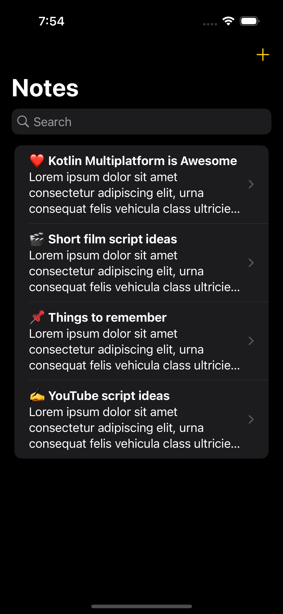
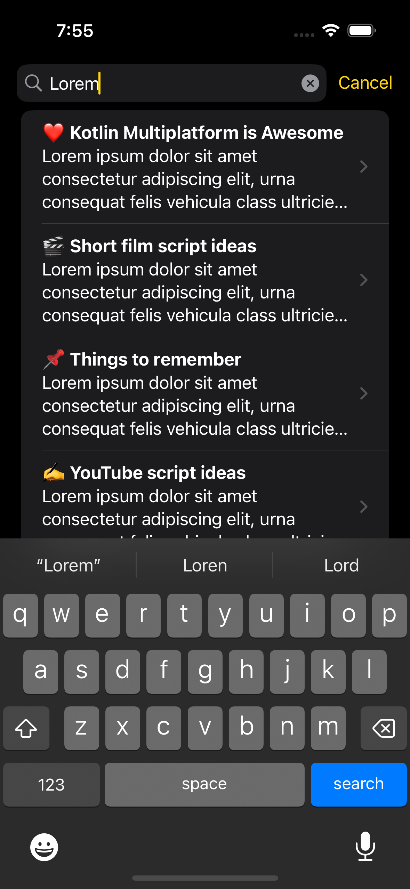
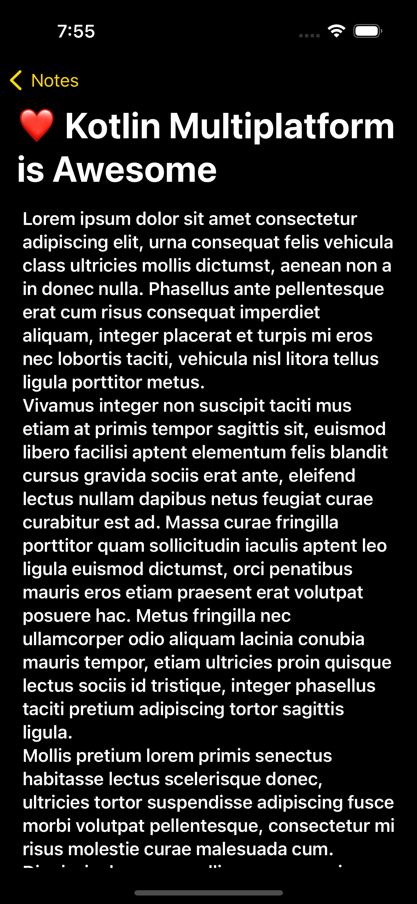
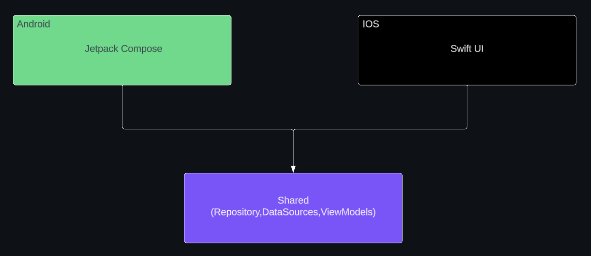

# Notes - A multiplatform notes app built with Kotlin Multiplatform

    

Notes is a simple note taking app built with [KMP(Kotlin Multiplatform)](https://kotlinlang.org/docs/multiplatform.html), formerly known as [KMM (Kotlin Multiplatform Mobile)](https://blog.jetbrains.com/kotlin/2023/07/update-on-the-name-of-kotlin-multiplatform/). The app is supported on both iOS and Android.

## Table of contents
1. [Screenshots](#screenshots)
2. [Tech Stack](#tech-stack)
3. [Notable Features](#notable-features)
4. [High-level Architecture Diagram](#high-level-architecture-diagram)
5. [Source code and architecture](#source-code-and-architecture)

## Screenshots

### Android
 &nbsp;  &nbsp;  

### IOS
 &nbsp;  &nbsp;  

## Tech Stack

### Common
- [Kotlin Coroutines](https://kotlinlang.org/docs/reference/coroutines/coroutines-guide.html) for threading.
- [Kotlinx-coroutines-test](https://kotlinlang.org/api/kotlinx.coroutines/kotlinx-coroutines-test/) for testing coroutines.
- [Kotlin Flows](https://developer.android.com/kotlin/flow) for creating reactive streams.
- [SQLDelight](https://github.com/cashapp/sqldelight) for local database.
- [Kotlinx Date-Time API](https://github.com/Kotlin/kotlinx-datetime) for date/time operations.
- Manual dependency injection on both platforms.

### Android
- [Jetpack Compose](https://developer.android.com/jetpack/compose) for UI and navigation on Android.
- [SplashScreen API](https://developer.android.com/develop/ui/views/launch/splash-screen) for displaying a splashscreen in a backwards compatible way.
- [Work Manager](https://developer.android.com/topic/libraries/architecture/workmanager?gclid=EAIaIQobChMIwJy33ufG8QIVGcEWBR31Mwa-EAAYASAAEgIF3vD_BwE&gclsrc=aw.ds) for background tasks.

### IOS
- [Swift UI](https://developer.apple.com/xcode/swiftui/) for UI and navigation on IOS.

## Notable features
<dl>
  <dt> Auto save 🪄 </dt>
  <dd> The app automatically saves the changes made to a note in an efficient manner. This precludes the need for the user to click a save button after every change, thus, significantly improving the UX of the app.</dd>
  <dt> Instant search 🔍 </dt>
  <dd> The app instantly starts to search for notes that match the provided search term, as the search term is being typed, in an efficient manner. It not only looks for matches to the title of the notes but also checks for matches to the contents of the notes as well. This ensures that search results are returned to the user as soon as possible.</dd>
  <dt> Native UI 🔮 </dt>
  <dd> The UI looks and feels native on each supported paltform - Android and IOS. This is because the the UI is built completely using UI tool kits that are native to each platform. This ensures that the user gets a native looking app on both the platforms. </dd>
    
  <dt> Themed splash screen 🎨</dt>
  <dd> In Android 12 and above, the background color of the splash screen matches the system theme. This minor detail, helps in improving the synergy of the app with the rest of the system from the moment the app is launched. </dd>    

  <dt> Themed App Icon 🦄 </dt>
  <dd> The app also supports the "Themed Icons" feature available on Android 13 and later. If the user has opted in for the feature on a device that is running Android 13 and higher, the app's icon will be tinted to inherit the coloring of the user’s chosen wallpaper and other themes.</dd>
</dl>

## High-level Architecture Diagram

## Source code and Architecture
- Uses MVVM architecture.
- All concrete implementations in the common module are prefixed by the term “Default”.
- Commit messages follow the [Conventional Commits](https://www.conventionalcommits.org/en/v1.0.0/) specification.
- The module structure is heavily based on the guidance mentioned in the ["Guide to architecture article"](https://developer.android.com/topic/architecture) posted on the offical android developers website.
  
## Disclaimer
I am primarily an Android developer and I learnt Swift and Swift UI on the fly, while I was developing the app. I am not familiar with ios development atall, so, there might be some slight issues with code quality on the ios side of things. My focus was to get the ios app, up and running as soon as possible with the very limited amount of knoweldge that I had on Swift.
